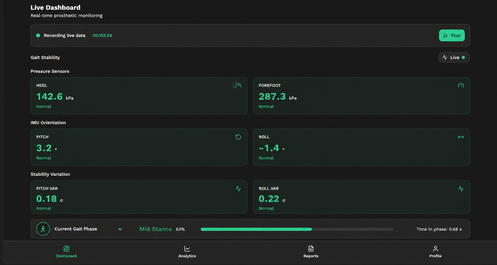
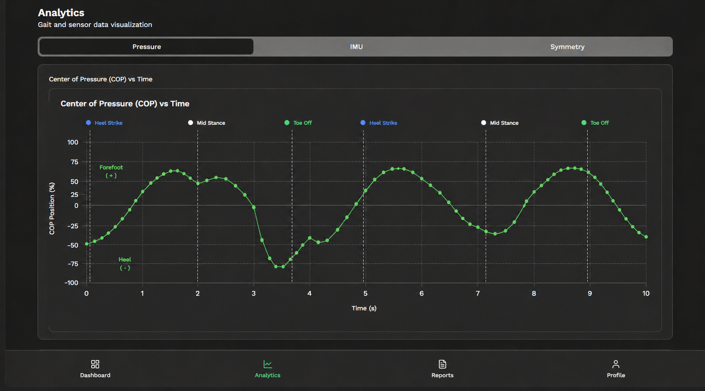
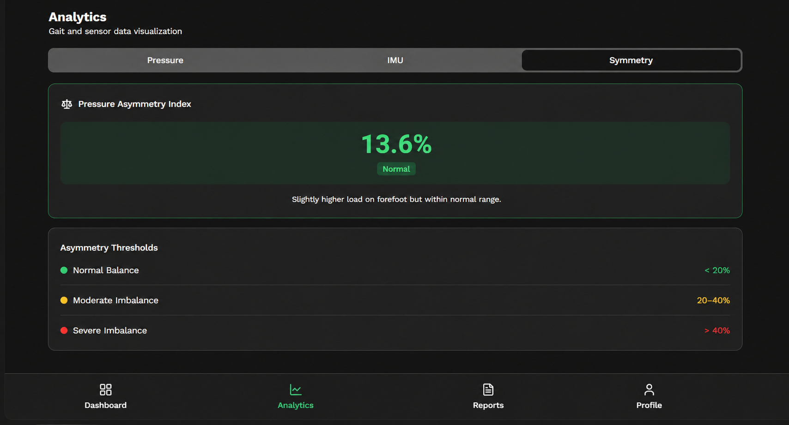
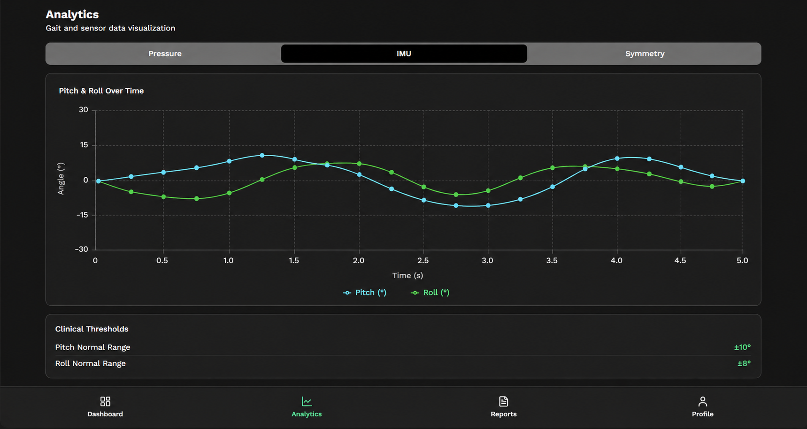
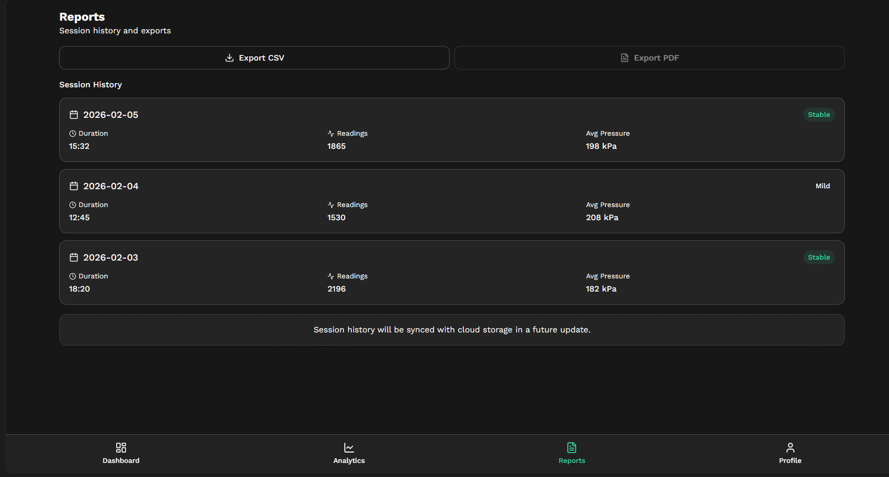
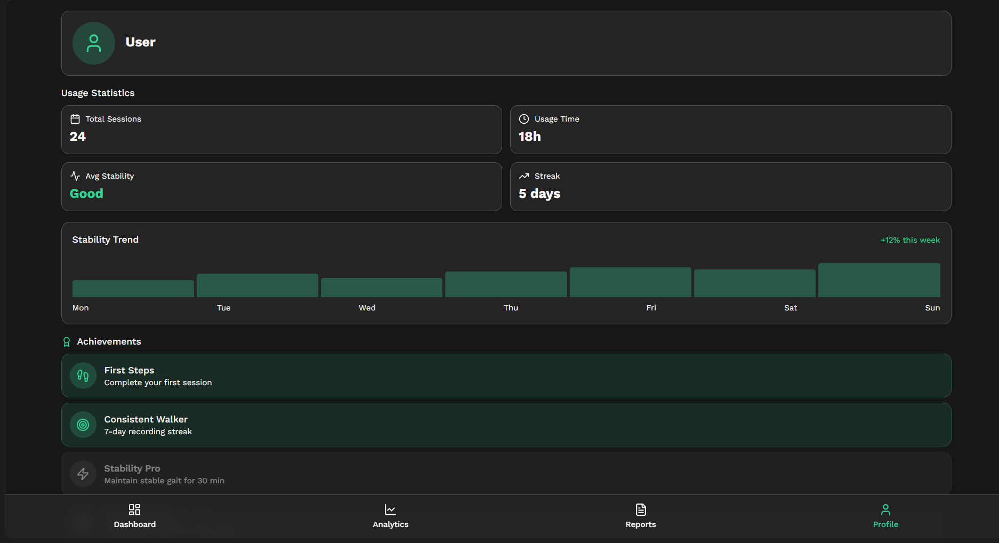
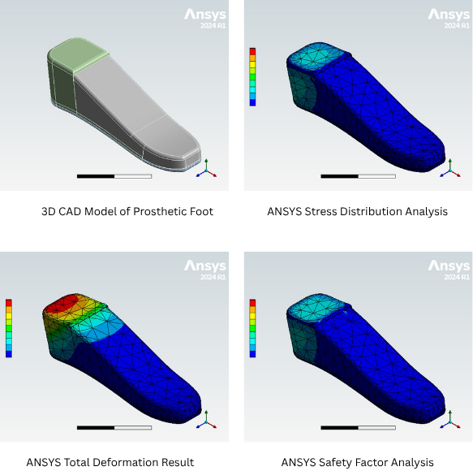

# StrideSense

**Smart 3D Printed Prosthetic Foot with Real-Time Gait Analysis and Pressure Monitoring**

---

## Overview

StrideSense is a functional prototype system that integrates embedded sensors directly into a prosthetic foot for real-time biomechanical monitoring. The system combines force-sensitive resistors (FSR) and inertial measurement units (IMU) to capture plantar pressure distribution and lower limb orientation. Data is wirelessly transmitted to a React-based visualization dashboard for clinical gait assessment and user feedback.

This prototype demonstrates practical implementation of embedded systems, sensor integration, and real-time data visualization in assistive medical technology.

The system has been implemented and tested as a working prototype with real-time data visualization. The current design is developed with a pediatric-scale prosthetic foot to enable easier fabrication, testing, and biomechanical analysis.

---

## Why StrideSense?

Traditional prosthetic systems lack real-time feedback on pressure distribution and gait dynamics, relying on expensive lab-based assessments and periodic clinical observation. This limits continuous monitoring and delays detection of instability or harmful loading patterns.

StrideSense overcomes this by embedding sensors within the prosthetic foot to capture real-time pressure and motion data. With wireless transmission and live dashboard visualization, it enables continuous, accessible, and data-driven gait monitoring in everyday environments.

---

## System Architecture


### Hardware Components
- ESP32 microcontroller (data acquisition & transmission)
- FSR sensors (heel & forefoot pressure)
- MPU6050 IMU (pitch & roll tracking)
- 3D-printed TPU prosthetic foot (pediatric model)

### Software Stack
- Embedded C/C++ (ESP32 firmware)
- React + TypeScript dashboard
- Tailwind CSS (UI)
- Supabase (backend database & cloud storage)

### Data Flow
FSR + IMU → ESP32 → Wi-Fi → Supabase → React Dashboard → Visualization

### System Workflow
1. Sensor data acquisition (pressure + motion)
2. Calibration and filtering
3. Real-time processing (PAI, COP, stability)
4. Data transmission to backend (Supabase)
5. Storage and retrieval of gait data
6. Visualization on dashboard

---

## Implemented Features

### Real-Time Sensor Data

- **Heel Pressure Monitoring**: Continuous pressure measurement from heel region FSR
- **Forefoot Pressure Monitoring**: Continuous pressure measurement from forefoot region FSR
- **IMU Orientation Tracking**: Real-time pitch and roll angle computation from accelerometer and gyroscope data

### Advanced Gait Parameters

- **Pressure Asymmetry Index (PAI)**: Quantifies imbalance between heel and forefoot pressure distribution
- **Center of Pressure (COP)**: Calculates the resultant pressure point on the plantar surface
- **Stability Variation Metrics**: Tracks changes in motion stability based on IMU data variations
- **Status Indicators**: Real-time classification of normal vs. abnormal gait patterns based on parameter thresholds

### System Capabilities

- Real-time data streaming at 100 Hz
- Multi-sensor fusion for comprehensive biomechanical assessment
- Low-latency wireless communication (typical <500 ms)
- Responsive dashboard with live metric updates
- Sensor calibration and baseline establishment

---

## Dashboard Visualization

<div style="display:flex; overflow-x:auto; gap:12px; padding:10px 0;">

  
  
  
  
  
  

</div>

---

## Design, Fabrication & Testing

### Design and Simulation



### Fabrication and Testing


### Electronics Integration


---

## Advanced Parameters

### Pressure Asymmetry Index (PAI)

Quantifies the degree of imbalance in pressure distribution between heel and forefoot regions:

$$\text{PAI} = \frac{|\text{Heel Pressure} - \text{Forefoot Pressure}|}{\text{Heel Pressure} + \text{Forefoot Pressure}} \times 100\%$$

Normal range: 0-20% (symmetric distribution)
Abnormal: >20% (asymmetric loading pattern)

### Center of Pressure (COP)

Represents the point of resultant force application on the plantar surface. Calculated from weighted pressure distribution across sensor locations.

Clinical significance: COP trajectory analysis aids in understanding gait symmetry and weight transfer mechanics.

### Stability Variation Metrics

Derived from IMU gyroscope data to assess postural stability and motion consistency:

- **Angular Velocity Variation**: Standard deviation of gyroscope measurements
- **Acceleration Variation**: Standard deviation of accelerometer measurements
- **Stability Index**: Composite metric reflecting overall lower limb stability

---

## Mechanical Validation & Testing

The prosthetic foot structure was engineered using thermoplastic polyurethane (TPU) through 3D printing fabrication for precise sensor integration and structural reliability.

### Material and Fabrication Specifications

- **Material**: TPU (Thermoplastic Polyurethane) with Shore A hardness of 95A
- **Fabrication Method**: 3D printing with layer thickness of 0.2 mm
- **Structural Weight**: Approximately 180 grams (pediatric model)
- **Design Scale**: Pediatric prosthetic foot for enhanced testing accuracy and reduced material costs

### Compression Testing Results

- **Maximum Load**: Withstood compression testing up to 20 kN without structural failure
- **Safe Deformation**: Material exhibited controlled elastic deformation within acceptable limits
- **Structural Integrity**: Post-test analysis confirmed maintenance of dimensional accuracy and sensor mounting stability
- **Recovery Rate**: Complete material recovery to original shape after load removal
- Link : [![Compression Test]](https://drive.google.com/file/d/1MsbJB7-RQVe4vxAYL-qSza_Um5krRSdc/view?usp=sharing)

### Design Advantages

- **Lightweight Construction**: The 180-gram design reduces lower limb fatigue and improves user mobility
- **Pediatric Model Benefit**: Smaller scale enables rapid prototyping, easier sensor integration testing, and cost-effective validation before scaling to adult prosthetics
- **Material Flexibility**: TPU's inherent flexibility mimics natural foot biomechanics while maintaining structural integrity for sensor support
- **Manufacturing Precision**: 3D printing enables precise cavity placement for FSR sensors and electronics integration with minimal tolerance stackup

---

## Technology Stack

| Category | Technology |
|----------|-----------|
| **Microcontroller** | ESP32 (dual-core, 100 Hz sampling) |
| **Pressure Sensors** | FSR 406 (heel & forefoot) |
| **IMU** | MPU6050 (6-axis: accel + gyro) |
| **Prosthetic Material** | TPU (3D-printed, pediatric scale) |
| **Firmware** | C/C++ (Arduino, PlatformIO - VS Code) |
| **Frontend** | React, TypeScript |
| **Styling** | Tailwind CSS, shadcn-ui |
| **Build System** | Vite |
| **Backend** | Supabase |
| **Simulation & Analysis** | ANSYS (FEA for structural validation) |
| **Communication** | Wi-Fi (TCP/UDP) |

---

## AI Integration (In Progress)

Lovable AI was used to assist with frontend development and dashboard UI prototyping during the development phase.

**Planned AI Features** (Under Development):
- Gait pattern classification from historical sensor data
- Automated anomaly detection in pressure distribution
- Personalized stability threshold recommendations
- Long-term trend analysis for rehabilitation tracking

*Note: Machine learning models are not yet implemented. Current system focuses on real-time sensor visualization and clinical parameter computation.*

---

## Biomedical Applications

- Real-time gait assessment for prosthetic users  
- Rehabilitation monitoring and progress tracking  
- Pressure ulcer risk detection  
- Biofeedback for gait improvement  
- Pediatric prosthetics research  

---

## Future Scope

- Integration of machine learning for gait classification  
- Higher-resolution pressure sensing  
- Mobile application development  
- Clinical validation with real-world data  
- Scaling to adult prosthetic designs  

---

## Disclaimer

StrideSense is developed as a biomedical engineering prototype system. Lovable AI was used as a development assistance tool for frontend code generation and UI design, but does not represent the core innovation of the hardware-software integration. All sensor calibration, hardware integration, firmware development, mechanical design, and system architecture decisions are based on original engineering work and testing.

This is a prototype system designed for research and evaluation purposes. Clinical deployment requires appropriate regulatory clearance and validation studies.

---

## Getting Started

### Prerequisites

- Node.js (v18 or higher) and npm installed ([install with nvm](https://github.com/nvm-sh/nvm#installing-and-updating))
- Git for version control
- ESP32 development board, FSR sensors, and MPU6050 module
- USB cable for ESP32 programming

### Installation & Setup

#### Clone the Repository

```sh
git clone https://github.com/Ruben-Samuel-S/stridesense.git
cd stridesense
```

#### Install Frontend Dependencies

```sh
npm install
```

#### Start Development Server

```sh
npm run dev
```

The dashboard will launch in your browser with hot-reload enabled.

#### Build for Production

```sh
npm run build
```

#### Deploy Dashboard

Deploy the compiled application to your preferred hosting platform (Vercel, Netlify, GitHub Pages, AWS, etc.).

### Embedded Firmware Setup

1. Install the [Arduino IDE](https://www.arduino.cc/en/software) or [PlatformIO](https://platformio.org/)
2. Install the ESP32 board support package in your IDE
3. Configure board: **ESP32 Dev Module**
4. Install required libraries:
   - `MPU6050` (by ElectroMech)
   - `ArduinoJson` (for data formatting)
   - `WiFi` (built-in)
5. Update Wi-Fi credentials in the firmware sketch
6. Load the firmware onto the ESP32
7. Configure sensor calibration values (baseline pressure readings)
8. Verify sensor connections and test data transmission to dashboard

### Sensor Calibration

Before deployment, perform baseline calibration:

1. **FSR Calibration**: Record zero-load readings; establish load-voltage mapping using known weights
2. **IMU Calibration**: Collect gyroscope bias values with sensor at rest; apply offsets in firmware
3. **Dashboard Verification**: Confirm real-time data display and parameter computation accuracy

---

## UI Preview

The React dashboard provides real-time monitoring of prosthetic function:

### Live Sensor Data Display

- **Heel Pressure**: Real-time pressure reading from heel region FSR with live waveform
- **Forefoot Pressure**: Real-time pressure reading from forefoot region FSR with live waveform
- **Pitch Angle**: Live plot of pitch (sagittal plane) rotation from IMU
- **Roll Angle**: Live plot of roll (frontal plane) rotation from IMU

### Clinical Metrics

- **Pressure Asymmetry Index (PAI)**: Percentage imbalance between heel and forefoot loading
- **Center of Pressure (COP)**: Graphical representation of resultant pressure point on plantar surface
- **Stability Variation**: Real-time stability index based on motion consistency
- **Status Indicator**: Real-time classification badge (Normal/Abnormal) based on parameter thresholds

### Features

- Live data refresh at 100 Hz acquisition rate
- Historical data trending over session duration
- Parameter threshold customization for individual users
- Data export functionality for offline analysis
- Responsive design for desktop and tablet viewing

---

## Contributing

Contributions, bug reports, and feature suggestions are welcome. Please open issues or submit pull requests to help improve the system.

---

## License

This project is provided for educational and research purposes. Consult relevant regulatory bodies and medical device regulations for clinical or commercial applications.

---

## Contact

For technical questions, collaboration inquiries, or feedback, please reach out through GitHub issues or contact the project maintainers.

---

**Last Updated**: April 2026  
**System Status**: Functional Prototype with Real-Time Data Acquisition, Visualization, and Mechanical Validation
