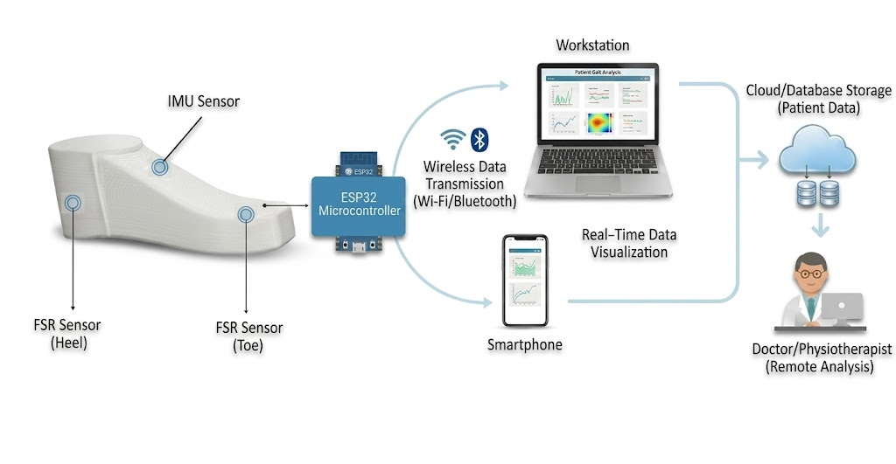
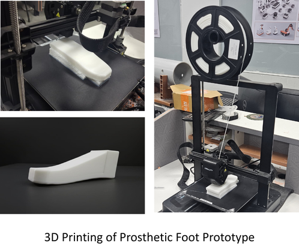
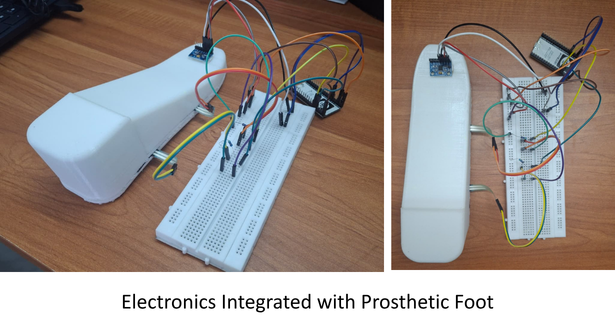

# StrideSense

**Smart Prosthetic Foot with Real-Time Gait Analysis and Pressure Monitoring**

---

## Overview

StrideSense is a functional prototype system that integrates embedded sensors directly into a prosthetic foot for real-time biomechanical monitoring. The system combines force-sensitive resistors (FSR) and inertial measurement units (IMU) to capture plantar pressure distribution and lower limb orientation. Data is wirelessly transmitted to a React-based visualization dashboard for clinical gait assessment and user feedback.

This prototype demonstrates practical implementation of embedded systems, sensor integration, and real-time data visualization in assistive medical technology.

The system has been implemented and tested as a working prototype with real-time data visualization. The current design is developed with a pediatric-scale prosthetic foot to enable easier fabrication, testing, and biomechanical analysis.

---

## Problem Statement

Traditional prosthetic limbs lack real-time feedback on plantar pressure distribution and gait kinematics, limiting:

- Clinical assessment of load distribution patterns and asymmetry
- User awareness of gait abnormalities and instability
- Optimization of prosthetic fitting and training protocols
- Prevention of pressure-related tissue damage through early warning

Current solutions either rely on external motion capture systems (expensive, lab-bound) or provide no biomechanical feedback to users in real-time.

---

## Proposed Solution

StrideSense is a working prototype system that embeds sensors directly into a prosthetic foot to provide:

- **Real-time pressure mapping** across heel and forefoot regions using calibrated FSR sensors
- **Motion tracking** via 6-axis IMU for orientation sensing (pitch and roll angles)
- **Stability analysis** through continuous motion variation monitoring
- **Wireless data streaming** enabling portable, wearable operation
- **Visual analytics dashboard** for clinicians and users to monitor gait quality in real time

The system operates independently and integrates seamlessly with standard prosthetic designs for clinical and personal use.

---

## System Architecture

### Hardware Components

- **Microcontroller**: ESP32 (dual-core, Wi-Fi capable, 12-bit ADC)
- **Pressure Sensors**: Force-Sensitive Resistors (FSR 402) at heel and forefoot locations
- **Motion Sensor**: MPU6050 (6-axis IMU: 3-axis accelerometer + 3-axis gyroscope)
- **Prosthetic Structure**: 3D-printed TPU (Thermoplastic Polyurethane) foot model
- **Design Scale**: Pediatric model for easier testing and biomechanical validation
- **Communication**: Wi-Fi protocol via ESP32 for real-time wireless data transmission
- **Sampling Rate**: 100 Hz for sensor data acquisition
- **Power**: Battery-powered with real-time operation capability

### Software Stack

- **Embedded Firmware**: C/C++ (Arduino framework on ESP32)
- **Data Acquisition**: Real-time sensor polling, calibration, and ADC conversion
- **Frontend Dashboard**: React + TypeScript for interactive real-time visualization
- **UI Framework**: Tailwind CSS + shadcn-ui for responsive design
- **Build Tool**: Vite for optimized development and production builds

### Data Flow

```
[FSR Sensors] ─┐
              ├─→ [ESP32] ──→ [Wi-Fi] ──→ [React Dashboard]
[MPU6050 IMU] ─┘                    (Real-time Visualization)
```

The ESP32 continuously samples pressure and motion data at 100 Hz, applies sensor calibration and filtering, and transmits processed data to the web dashboard. The dashboard renders real-time pressure maps, orientation plots, stability metrics, and clinical indicators with minimal latency.

### System Workflow

1. **Sensor Acquisition**: ESP32 reads FSR analog values (heel & forefoot pressure) and MPU6050 acceleration/gyroscope data at 100 Hz
2. **Sensor Calibration**: Applied calibration offsets for accurate pressure measurement; gyroscope bias correction
3. **Data Processing**: Real-time filtering and computation of derived metrics (pitch, roll, stability variation, pressure asymmetry)
4. **Wireless Transmission**: Processed data streamed via Wi-Fi to the React dashboard application
5. **Real-Time Visualization**: Dashboard displays pressure heatmaps, IMU orientation, stability indicators, and clinical metrics
6. **Clinical Analysis**: Pressure Asymmetry Index (PAI), Center of Pressure (COP), and stability variation metrics calculated and displayed

---

## Implemented Features

### Real-Time Sensor Data

- **Heel Pressure Monitoring**: Continuous pressure measurement from heel region FSR
- **Forefoot Pressure Monitoring**: Continuous pressure measurement from forefoot region FSR
- **IMU Orientation Tracking**: Real-time pitch and roll angle computation from accelerometer and gyroscope data

### Advanced Gait Parameters

- **Pressure Asymmetry Index (PAI)**: Quantifies imbalance between heel and forefoot pressure distribution
- **Center of Pressure (COP)**: Calculates the resultant pressure point on the plantar surface
- **Stability Variation Metrics**: Tracks changes in motion stability based on IMU data variations
- **Status Indicators**: Real-time classification of normal vs. abnormal gait patterns based on parameter thresholds

### System Capabilities

- Real-time data streaming at 100 Hz
- Multi-sensor fusion for comprehensive biomechanical assessment
- Low-latency wireless communication (typical <500 ms)
- Responsive dashboard with live metric updates
- Sensor calibration and baseline establishment

---

## Sample Output

### System Architecture Diagram



### Real-Time Pressure and Motion Visualization


### User Dashboard Interface


---

## Design, Fabrication & Testing

### Design and Simulation


### Fabrication and Testing



### Electronics Integration



---

## Advanced Parameters

### Pressure Asymmetry Index (PAI)

Quantifies the degree of imbalance in pressure distribution between heel and forefoot regions:

$$\text{PAI} = \frac{|\text{Heel Pressure} - \text{Forefoot Pressure}|}{\text{Heel Pressure} + \text{Forefoot Pressure}} \times 100\%$$

Normal range: 0-20% (symmetric distribution)
Abnormal: >20% (asymmetric loading pattern)

### Center of Pressure (COP)

Represents the point of resultant force application on the plantar surface. Calculated from weighted pressure distribution across sensor locations.

Clinical significance: COP trajectory analysis aids in understanding gait symmetry and weight transfer mechanics.

### Stability Variation Metrics

Derived from IMU gyroscope data to assess postural stability and motion consistency:

- **Angular Velocity Variation**: Standard deviation of gyroscope measurements
- **Acceleration Variation**: Standard deviation of accelerometer measurements
- **Stability Index**: Composite metric reflecting overall lower limb stability

---

## Mechanical Validation

The prosthetic foot structure was engineered using thermoplastic polyurethane (TPU) through 3D printing fabrication for precise sensor integration and structural reliability.

### Material and Fabrication Specifications

- **Material**: TPU (Thermoplastic Polyurethane) with Shore A hardness of 95A
- **Fabrication Method**: 3D printing with layer thickness of 0.2 mm
- **Structural Weight**: Approximately 180 grams (pediatric model)
- **Design Scale**: Pediatric prosthetic foot for enhanced testing accuracy and reduced material costs

### Compression Testing Results

- **Maximum Load**: Withstood compression testing up to 20 kN without structural failure
- **Safe Deformation**: Material exhibited controlled elastic deformation within acceptable limits
- **Structural Integrity**: Post-test analysis confirmed maintenance of dimensional accuracy and sensor mounting stability
- **Recovery Rate**: Complete material recovery to original shape after load removal

### Design Advantages

- **Lightweight Construction**: The 180-gram design reduces lower limb fatigue and improves user mobility
- **Pediatric Model Benefit**: Smaller scale enables rapid prototyping, easier sensor integration testing, and cost-effective validation before scaling to adult prosthetics
- **Material Flexibility**: TPU's inherent flexibility mimics natural foot biomechanics while maintaining structural integrity for sensor support
- **Manufacturing Precision**: 3D printing enables precise cavity placement for FSR sensors and electronics integration with minimal tolerance stackup

---

## Technology Stack

| Category | Technology |
|----------|-----------|
| **Microcontroller** | ESP32 (dual-core, 100 Hz sampling) |
| **Pressure Sensors** | FSR 402 (heel & forefoot) |
| **IMU** | MPU6050 (6-axis: accel + gyro) |
| **Prosthetic Material** | TPU (3D-printed, pediatric scale) |
| **Firmware** | C/C++ (Arduino) |
| **Frontend** | React, TypeScript |
| **Styling** | Tailwind CSS, shadcn-ui |
| **Build System** | Vite |
| **Communication** | Wi-Fi (TCP/UDP) |

---

## AI Integration (In Progress)

Lovable AI was used to assist with frontend development and dashboard UI prototyping during the development phase.

**Planned AI Features** (Under Development):
- Gait pattern classification from historical sensor data
- Automated anomaly detection in pressure distribution
- Personalized stability threshold recommendations
- Long-term trend analysis for rehabilitation tracking

*Note: Machine learning models are not yet implemented. Current system focuses on real-time sensor visualization and clinical parameter computation.*

---

## My Contributions

- **Hardware Integration**: Selected, integrated, and calibrated FSR and MPU6050 sensors for accurate real-time measurements
- **ESP32 Firmware Development**: Worked on sensor data acquisition, calibration routines, and wireless communication protocols
- **System Integration**: Established and tested communication pipeline between hardware sensors and software dashboard
- **Dashboard Development**: Collaborated on React frontend design with real-time data visualization components
- **Parameter Implementation**: Implemented computation of Pressure Asymmetry Index, Center of Pressure, and stability variation metrics
- **Mechanical Design**: Worked on pediatric prosthetic foot design in TPU for sensor integration and structural validation
- **Fabrication and Testing**: Conducted compression testing, mechanical validation, and sensor integration verification
- **System Testing**: Conducted sensor validation, calibration verification, and end-to-end prototype testing
- **Documentation**: Created technical documentation for system architecture, setup, and future development

---

## Biomedical Applications

- **Clinical Gait Assessment**: Non-invasive evaluation of prosthetic user gait patterns in real time
- **Prosthetic Fitting Optimization**: Real-time feedback for clinicians during device adjustment and alignment
- **Rehabilitation Progress Monitoring**: Tracking stability and pressure distribution improvements during therapy
- **Pressure Ulcer Risk Assessment**: Detection of high-pressure zones to reduce tissue injury risk
- **User Gait Awareness**: Real-time biofeedback enabling users to self-correct walking patterns
- **Pediatric Prosthetics Research**: Supports early-stage gait analysis and assistive device development for children
- **Research Platform**: Standardized, reproducible system for prosthetics research and biomechanics studies

---

## Future Scope

- **Machine Learning Integration**: Implement gait phase classification and personalized pattern recognition
- **Extended Sensor Coverage**: Additional pressure sensors for higher-resolution plantar mapping
- **Long-Term Data Analytics**: Historical trend analysis and regression tracking for rehabilitation assessment
- **Mobile Application**: Native iOS/Android app for on-the-go access and data review
- **Low-Power Optimization**: Bluetooth Low Energy (BLE) support for extended battery life
- **Clinical Validation Study**: Comparative analysis with gold-standard motion capture systems
- **Adult Prosthetic Scaling**: Scale design to adult foot dimensions for broader clinical application
- **Multi-User Platform**: Support for tracking multiple prosthetic wearers with centralized data management
- **Automated Alerts**: Threshold-based notifications for abnormal pressure patterns or instability

---

## Disclaimer

StrideSense is developed as a biomedical engineering prototype system. Lovable AI was used as a development assistance tool for frontend code generation and UI design, but does not represent the core innovation of the hardware-software integration. All sensor calibration, hardware integration, firmware development, mechanical design, and system architecture decisions are based on original engineering work and testing.

This is a prototype system designed for research and evaluation purposes. Clinical deployment requires appropriate regulatory clearance and validation studies.

---

## Getting Started

### Prerequisites

- Node.js (v18 or higher) and npm installed ([install with nvm](https://github.com/nvm-sh/nvm#installing-and-updating))
- Git for version control
- ESP32 development board, FSR sensors, and MPU6050 module
- USB cable for ESP32 programming

### Installation & Setup

#### Clone the Repository

```sh
git clone https://github.com/Ruben-Samuel-S/stridesense.git
cd stridesense
```

#### Install Frontend Dependencies

```sh
npm install
```

#### Start Development Server

```sh
npm run dev
```

The dashboard will launch in your browser with hot-reload enabled.

#### Build for Production

```sh
npm run build
```

#### Deploy Dashboard

Deploy the compiled application to your preferred hosting platform (Vercel, Netlify, GitHub Pages, AWS, etc.).

### Embedded Firmware Setup

1. Install the [Arduino IDE](https://www.arduino.cc/en/software) or [PlatformIO](https://platformio.org/)
2. Install the ESP32 board support package in your IDE
3. Configure board: **ESP32 Dev Module**
4. Install required libraries:
   - `MPU6050` (by ElectroMech)
   - `ArduinoJson` (for data formatting)
   - `WiFi` (built-in)
5. Update Wi-Fi credentials in the firmware sketch
6. Load the firmware onto the ESP32
7. Configure sensor calibration values (baseline pressure readings)
8. Verify sensor connections and test data transmission to dashboard

### Sensor Calibration

Before deployment, perform baseline calibration:

1. **FSR Calibration**: Record zero-load readings; establish load-voltage mapping using known weights
2. **IMU Calibration**: Collect gyroscope bias values with sensor at rest; apply offsets in firmware
3. **Dashboard Verification**: Confirm real-time data display and parameter computation accuracy

---

## UI Preview

The React dashboard provides real-time monitoring of prosthetic function:

### Live Sensor Data Display

- **Heel Pressure**: Real-time pressure reading from heel region FSR with live waveform
- **Forefoot Pressure**: Real-time pressure reading from forefoot region FSR with live waveform
- **Pitch Angle**: Live plot of pitch (sagittal plane) rotation from IMU
- **Roll Angle**: Live plot of roll (frontal plane) rotation from IMU

### Clinical Metrics

- **Pressure Asymmetry Index (PAI)**: Percentage imbalance between heel and forefoot loading
- **Center of Pressure (COP)**: Graphical representation of resultant pressure point on plantar surface
- **Stability Variation**: Real-time stability index based on motion consistency
- **Status Indicator**: Real-time classification badge (Normal/Abnormal) based on parameter thresholds

### Features

- Live data refresh at 100 Hz acquisition rate
- Historical data trending over session duration
- Parameter threshold customization for individual users
- Data export functionality for offline analysis
- Responsive design for desktop and tablet viewing

---

## Contributing

Contributions, bug reports, and feature suggestions are welcome. Please open issues or submit pull requests to help improve the system.

---

## License

This project is provided for educational and research purposes. Consult relevant regulatory bodies and medical device regulations for clinical or commercial applications.

---

## Contact

For technical questions, collaboration inquiries, or feedback, please reach out through GitHub issues or contact the project maintainers.

---

**Last Updated**: April 2026  
**System Status**: Functional Prototype with Real-Time Data Acquisition, Visualization, and Mechanical Validation
